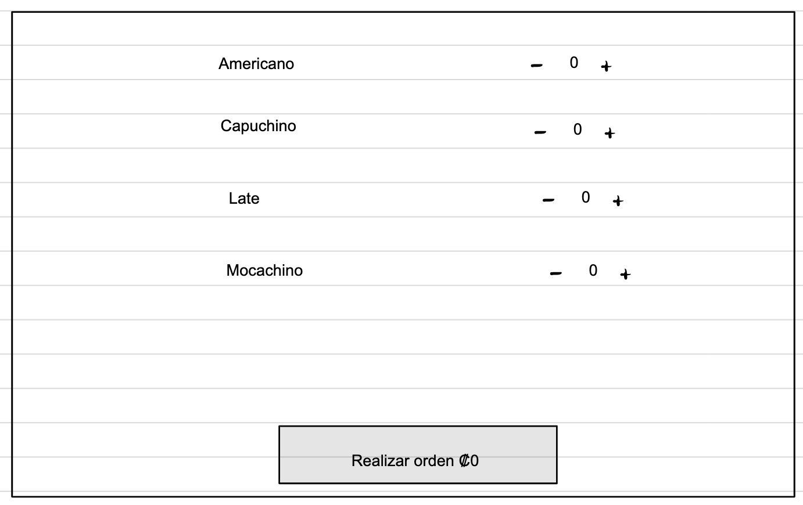
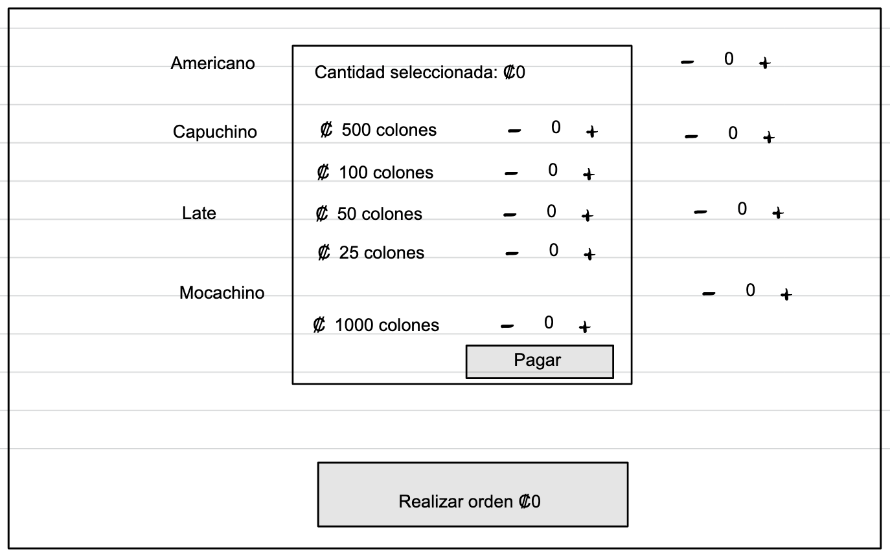
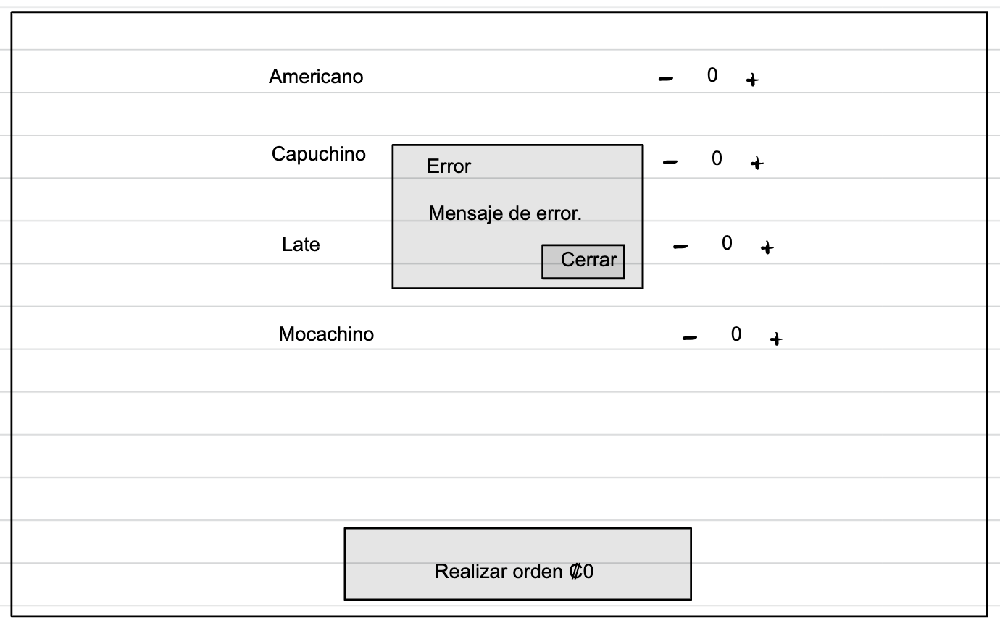
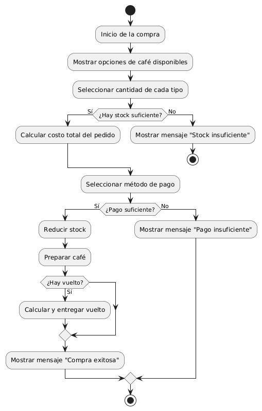

# Segunda Parte - Examen 2 - IS
## C11142 - Sebastián Bolaños Serrano

### Repositorio
- **URL:** https://github.com/sebasbose/coffee_machine-ci_0126

### Mockup
**Mockup #1:**

**Mockup #2:**

**Mockup #3:**

### Diagrama UML:
